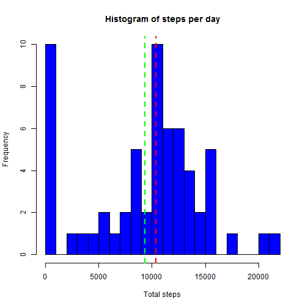
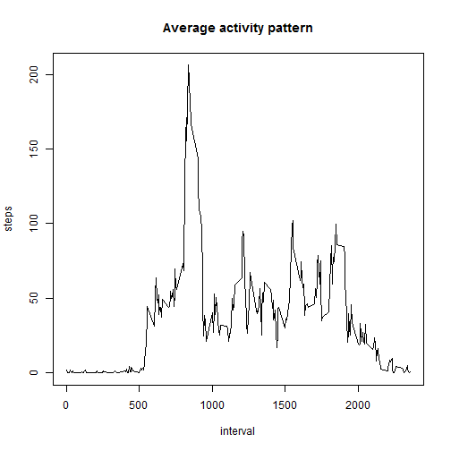
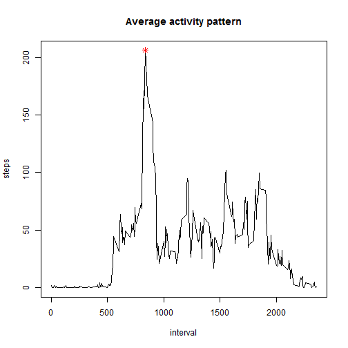
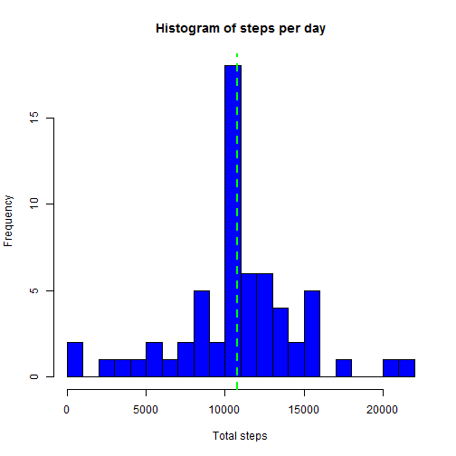
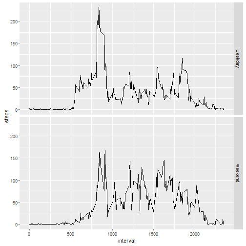

## Loading and preprocessing the data
Extracts the .zip file in a temporary folder and read the .csv file


```r
tmp <- tempdir()
unzip('activity.zip', exdir = tmp)
activity<-read.csv(file.path(tmp, 'activity.csv'), na.strings = 'NA')
```

Format the dates properly

```r
activity$date <- as.Date(activity$date, format('%Y-%m-%d'))
```


## What is mean total number of steps taken per day?
First, calculate the number of steps per day

```r
library(dplyr)
```

```
## Warning: package 'dplyr' was built under R version 3.2.3
```

```
## 
## Attaching package: 'dplyr'
```

```
## The following objects are masked from 'package:stats':
## 
##     filter, lag
```

```
## The following objects are masked from 'package:base':
## 
##     intersect, setdiff, setequal, union
```

```r
stepsPerDay <- group_by(activity, date) %>% summarize(steps = sum(steps, na.rm = TRUE))
```

For this data, the median of the number of steps is

```r
median(stepsPerDay$steps)
```

```
## [1] 10395
```
And the mean is

```r
mean(stepsPerDay$steps)
```

```
## [1] 9354.23
```

Additionally we can create an histogram where the median is the red line and the mean the green one

```r
hist(stepsPerDay$steps, breaks = 30, col = 'blue', main = 'Histogram of steps per day', xlab = 'Total steps')
abline(v = median(stepsPerDay$steps), col = 'red', lty=2, lwd = 2)
abline(v = mean(stepsPerDay$steps), col = 'green', lty=2, lwd = 2)
```



In this histogram we can see that there is a big bar at 0, which is becase of days without any acitivity reported (NA for all intervals in the day)

## What is the average daily activity pattern?
First calculate the values per interval period across all days


```r
stepsPerInterval <- group_by(activity, interval) %>% summarize(steps = mean(steps, na.rm = TRUE))
```

and then we can plot the time series

```r
with(stepsPerInterval, plot(interval, steps, type='l', main='Average activity pattern'))
```



and locate interval with the maximum value

```r
idx <- which.max(stepsPerInterval$steps)
stepsPerInterval$interval[idx]
```

```
## [1] 835
```
which corresponds with 8:35 in the morning.

Finally we can print this point in the graph

```r
with(stepsPerInterval, plot(interval, steps, type='l', main='Average activity pattern'))
with(stepsPerInterval, points(interval[idx], steps[idx], pch=8, col='red'))
```



## Imputing missing values
Now review the missing values

The total number of missing values are

```r
sum(is.na(activity$steps))
```

```
## [1] 2304
```

which, in percentage compared with the total values is

```r
sum(is.na(activity$steps))/length(activity$steps)*100
```

```
## [1] 13.11475
```

So let's see how we can fill in those missing values.

One strategy is to use the mean or median per day. However, in order to apply this strategy, it is necessary that all days contains at least one valid sample. Lets check it. For that, we can aggregate without ignoring the na.rm and check if there are days without data:


```r
stepsPerDayNA <- group_by(activity, date) %>% summarize(isna = sum(!is.na(steps)))
stepsPerDayNA$date[stepsPerDayNA$isna == 0]
```

```
## [1] "2012-10-01" "2012-10-08" "2012-11-01" "2012-11-04" "2012-11-09"
## [6] "2012-11-10" "2012-11-14" "2012-11-30"
```

So we have 8 dates without any data at all, making this approach not possible.

Then, take review the other option: taking the mean value for the interval. Let's check the values as well:

```r
stepsPerIntervalNA <- group_by(activity, interval) %>% summarize(isna = sum(!is.na(steps)))
stepsPerIntervalNA$interval[stepsPerIntervalNA$isna == 0]
```

```
## integer(0)
```

So there is no any interval without at least one value. Then let's use the mean for every interval across all days in order to fill in the missing data.

```r
activityNonNA <- group_by(activity, interval) %>%     # Group by interval
                  mutate(steps = ifelse(is.na(steps), # Select mean if not available
                         mean(steps, na.rm = TRUE), 
                         steps))
```

Let's check the new dataset has no NA values

```r
sum(is.na(activityNonNA$steps))
```

```
## [1] 0
```

And then we can repeat the same histogram of steps per day, plus mean and median with the clean dataset:

```r
stepsPerDayNonNA <- group_by(activityNonNA, date) %>% summarize(steps = sum(steps, na.rm = TRUE))
hist(stepsPerDayNonNA$steps, breaks = 30, col = 'blue', main = 'Histogram of steps per day', xlab = 'Total steps')
abline(v = median(stepsPerDayNonNA$steps), col = 'red', lty=2, lwd = 2)
abline(v = mean(stepsPerDayNonNA$steps), col = 'green', lty=2, lwd = 2)
```


 
Compared to the previous histogram, we can see now how the number of days with very low value have been decreased by 8, which are the days we detected with NA values. Now these days have been accumulated into the 10000 bar, in the middle of the histogram.

We can also see how mean (green line) and median (red line) were increased. Their values are

```r
median(stepsPerDayNonNA$steps)
```

```
## [1] 10766.19
```

```r
mean(stepsPerDayNonNA$steps)
```

```
## [1] 10766.19
```

## Are there differences in activity patterns between weekdays and weekends?

Let's add a new variable to the dataset, indicating if it is a weekday or weekend:

```r
activityNonNA$day.type <- factor(weekdays(activityNonNA$date, abbreviate = TRUE) %in% c('sáb', 'dom'), labels = c('weekday', 'weekend'))
```

Then we can aggregate by both interval and day.type for analyzing the difference between weekday and weekend

```r
stepsPerDayType <- activityNonNA %>%
                      group_by(interval, day.type) %>%
                      summarize(steps = mean(steps))
```

And then we can plot it

```r
library(ggplot2)
```

```
## Warning: package 'ggplot2' was built under R version 3.2.3
```

```r
qplot(interval, steps, data=stepsPerDayType, geom='line', facets = day.type ~ .)
```



Comparing weekday and weekend, we can derive that on weekends the subject starts and ends the activity later compared with weekday. On weekdays there is a peak about interval '800', which reflects 8:00 AM, and then the user is more static for the following hours (working hours). This behaviour is not that relevant on weekends.
